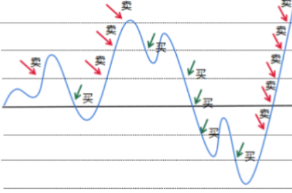
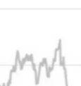

### 网格设计

 网格设计：

1.以基准金`CENTER`为中心，将网格`n`等分，每行之间的差距为扑捉波动的大小`GridSize`，当下降`GridSize`时，以当日最低价买入

2.记录已买入的股`buy`，当遇到对于某股收益达到了期望收益率`YIELD`的情况时`buy[i].sell`，以当日最高价卖出

3.每日记录最高价和最低价，判断增减趋势，并当最高价和最低价的连线与网格相交时，考虑做出反应

(注意：当数据与网格相交时，不一定需要买入和卖出，要看是否有一格的距离) 

---
### 任务列表

- [ ] 1.用户设置和修改参数的界面。
参数有：
- 基准价`CENTER`（元/股）
- 网格大小 / 扑捉波动的大小`GridSize`（%）
- 期望收益率`YIELD`（%）
- 买入金额`FUND`（元）
- 模型行数`ROWS`

（`GridSize`，`YIELD`一般在 5 到 15 之间）
- [ ] 已完成的就删掉了

- [ ] 1.实行`advice`时，先判断参数是否设置完全，若未完全，跳转到设置参数界面。接着，判断是否存在txt文件，默认文件名为`file.txt`。

- [ ] 2.买入部分

- [ ] 3.卖出部分
